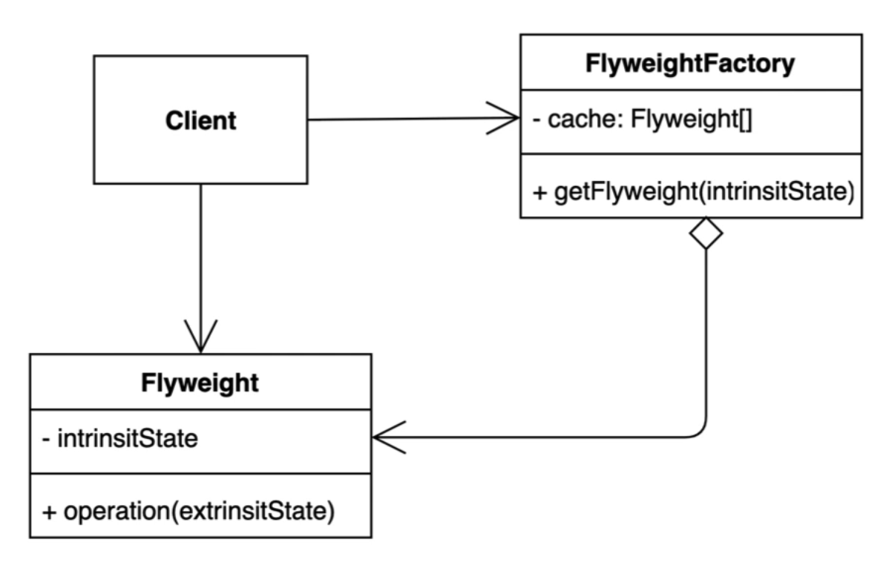

# Flyweight Pattern

객체를 가볍게 만들어 메모리 사용을 줄이는 패턴

- 자주 변하는 속성(또는 외적인 속성, extrinsic)과 변하지 않는 속성(또는 내적인 속성, intrinsic)을 분리하고 재사용하여 메모리 사용을 줄일 수 있다.

- 장점
    - 애플리케이션에서 사용하는 메모리를 줄일 수 있다.
- 단점
    - 코드의 복잡도가 증가한다.



```java
public final class Font {
	final String family;
	final int size;

	public Font(String family, int size) {}
		this.family = family;
		this.size = size;
	}

	// Getter
}

public class Character {
	private char value;
	private String color;
	private Font font;

	public Character(char value, String color, Font font) {
		this.value = value;
		this.color = color;
		this.font = font;
	}
}

public class FontFactory {
	private Map<String, Font> cache = new HashMap<>();
	
	public Font getFont(String font) {
		if (cache.containKey(font)) {
			return cache.get(font);
		} else {
			String[] split = font.split(":");
			Font newFont = new Font(split[0], Integer.parseInt(split[1]));
			cache.put(font, newFont);
			return newFont;
		}
	}
}

public static void main() {
	FontFactory fontFactory = new FontFactory();
	Character c1 = new Character('h', "white", fontFactory.getFont("namu:12"));
	Character c2 = new Character('e', "white", fontFactory.getFont("namu:12"));
	Character c3 = new Character('l', "white", fontFactory.getFont("namu:12"));
}
```

```java
Integer i1 = Integer.valueOf(10);
Integer i2 = Integer.valueOf(10);
System.out.println(i1 == i2); // -128 ~ 127 까지 캐싱된 Integer를 사용하여 같은값
// 숫자나 문자열을 비교할 경우 .equals() 메소드를 사용하는게 바람직하다.
```
